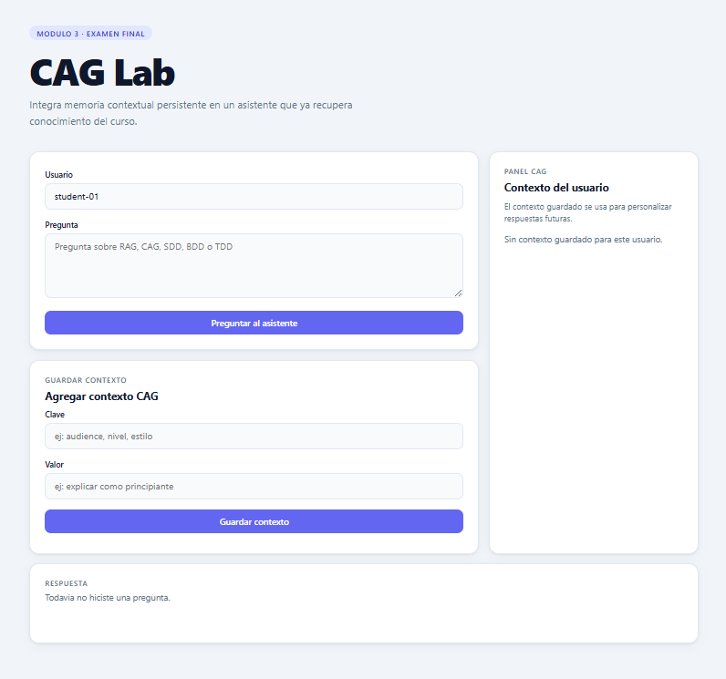

# Proyecto Examen Final - Modulo 3
**Estudiante:** Miguel Alfonso Dubon
**Carne:** 0900-21-6641
**Curso:** Inteligencia Artificial - Modulo 3
**Universidad:** Mariano Galvez de Guatemala
**Repositorio:** https://github.com/AlfonsoDbn-314/final_project_AI_CUSTOM

---

## Interpretacion del proyecto

El proyecto base entregado implementaba un asistente con RAG (Retrieval-Augmented Generation):
el sistema buscaba fragmentos relevantes en una base documental y los usaba para responder preguntas.
Sin embargo, cada consulta era independiente - el sistema no recordaba nada del usuario entre turnos.

El reto fue integrar CAG (Context-Augmented Generation): un modulo que permite al sistema
recordar preferencias, decisiones e historial del usuario para personalizar respuestas futuras.
Se implemento persistencia real usando Redis como almacen de contexto por usuario.

### Diferencia clave RAG vs CAG

| | RAG | CAG |
|---|---|---|
| Fuente | Documentos externos | Contexto del usuario |
| Persistencia | Ninguna (por consulta) | Acumulativa (por sesion) |
| Personalizacion | No | Si |
| Ejemplo | Busca en knowledge_base.json | Recuerda que Luis prefiere explicaciones para principiantes |

### Flujo implementado

    Usuario guarda contexto:
    POST /api/context { user_id, key, value } → Redis

    Usuario hace pregunta:
    POST /api/ask { user_id, question }
      → RAG recupera fragmentos de knowledge_base.json
      → CAG recupera contexto del usuario desde Redis
      → apply_context enriquece la respuesta con el contexto
      → Retorna respuesta personalizada + context_used

---

## Proceso de desarrollo - Scrum

### Sprint 1 - Analisis y diseno
**Objetivo:** Entender el proyecto base y disenar la solucion CAG

| Tarea | Commit |
|---|---|
| Analisis de codigo base y tests de validacion | - |
| Diseno de ContextStore en memoria | - |
| Implementacion de ContextStore con save y list_for_user | 8285b31 |
| Implementacion de apply_context en cag.py | 1b95ccb |

**Resultado:** ContextStore y apply_context funcionando. Tests saves y retrieves pasando.

### Sprint 2 - Integracion, persistencia y entrega
**Objetivo:** Integrar CAG en el pipeline, agregar Redis y completar entregables

| Tarea | Commit |
|---|---|
| Integracion CAG en assistant.py y server.py | e49de6d |
| 6/6 tests pasando (base + validacion) | e49de6d |
| Implementacion de ContextStoreRedis con Redis | 48dd561 |
| 10 pruebas propias BDD/TDD | 496556f |
| Pull Request feat(cag) creado y mergeado a main | PR #1 |
| README, PROMPTS.md, informe ejecutivo | ff0df68 |
| Documentacion Scrum completa | 8b621bb |
| Capturas en docs/evidencias/ | 73725ba |

**Resultado:** Modulo CAG completo con Redis. 16 tests pasando. Documentacion completa.

---

## Modulo CAG implementado

| Archivo | Descripcion |
|---|---|
| backend/context_store.py | ContextStore en memoria (implementacion base) |
| backend/context_store_redis.py | ContextStoreRedis con persistencia real en Redis |
| backend/cag.py | apply_context enriquece respuesta con contexto del usuario |
| backend/assistant.py | Pipeline RAG + CAG integrado via inyeccion de dependencia |
| backend/server.py | Endpoints /api/ask y /api/context conectados al modulo CAG |

---

## Requisitos

    pip install redis>=4.0,<5.0

Redis debe estar corriendo localmente en puerto 6379.

---

## Ejecutar el sistema completo

### Paso 1 - Iniciar Redis
Verificar que Redis esta corriendo:

    redis-cli ping
    → PONG

### Paso 2 - Iniciar backend

    PYTHONPATH=. python3 -m backend.server

Backend disponible en http://127.0.0.1:8000

### Paso 3 - Abrir frontend
Abrir el archivo en el navegador:

    frontend/index.html

O desde la terminal:

    start frontend\index.html

El frontend CAG Lab estara disponible en el navegador conectado al backend en puerto 8000.

### Demo rapida del CAG
1. Abrir frontend con usuario: luis
2. Guardar contexto via API:
       POST /api/context {"user_id":"luis","key":"audience","value":"explicar como principiante"}
3. Preguntar: Que es CAG?
4. La respuesta incluira [audience: explicar como principiante] y context_used: ["audience"]

---

## Ejecutar pruebas base

    PYTHONPATH=. python -m unittest discover -s tests/base -p "test_*.py" -v

## Ejecutar pruebas de validacion

    PYTHONPATH=. python -m unittest discover -s tests/validation -p "test_*.py" -v

## Ejecutar pruebas propias

    PYTHONPATH=. python -m unittest tests/test_cag_own.py -v

## Resultados de pruebas

- tests/base: 3/3 OK
- tests/validation: 3/3 OK
- tests/test_cag_own.py: 10/10 OK

---

## Estructura del repositorio

| Ruta | Contenido |
|---|---|
| backend/ | Servidor HTTP, RAG, modulo CAG y Redis |
| frontend/ | Interfaz web estatica (CAG Lab) |
| data/ | Base de conocimiento del curso |
| tests/base/ | Pruebas base del proyecto original |
| tests/validation/ | Pruebas de contrato CAG del profesor |
| tests/test_cag_own.py | Pruebas propias BDD/TDD (10 casos) |
| docs/scrum/ | Backlog, Sprint 1 y Sprint 2 |
| docs/evidencias/ | Capturas del proceso y verificacion |
| docs/informe_ejecutivo.md | Informe ejecutivo con bitacora de desarrollo |
| PROMPTS.md | Registro cronologico de uso de IA |
| requirements.txt | Dependencias del proyecto |

---

## Evidencias

Ver carpeta docs/evidencias/ con capturas de:
- Tests base y validacion pasando
- Frontend CAG Lab funcionando con contexto activo
- Pull Request mergeado
- Historial de commits incrementales
- Tests con Redis
## Vista del Frontend

